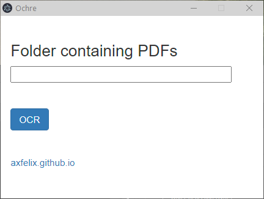

# Ochre

I made this because I found myself sharing shell scripts that do this same thing with way too many people who didn't want to have to run shell scripts.

Uses a set of very venerable open source tools (tesseract, ghostscript, pdftk) to OCR a folder containing PDFs. Windows-only for now, as the state of free tools on Windows if you don't have access to Acrobat is a lot more dire than on other platforms, and packaging all these binaries per-platform is nontrivial. Let me know if you want Mac support. The licensing on this is messy as at least some of what I'm redistributing is GPL, but it's going to remain open source and free to use whatever I decide.